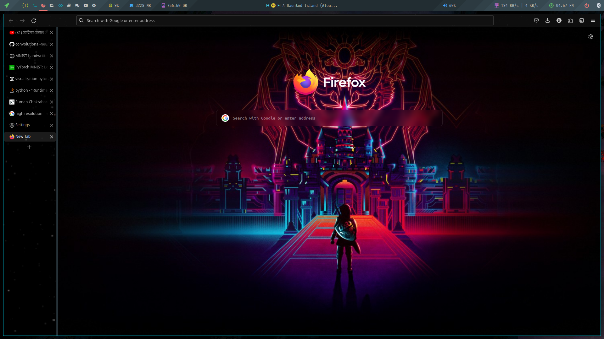
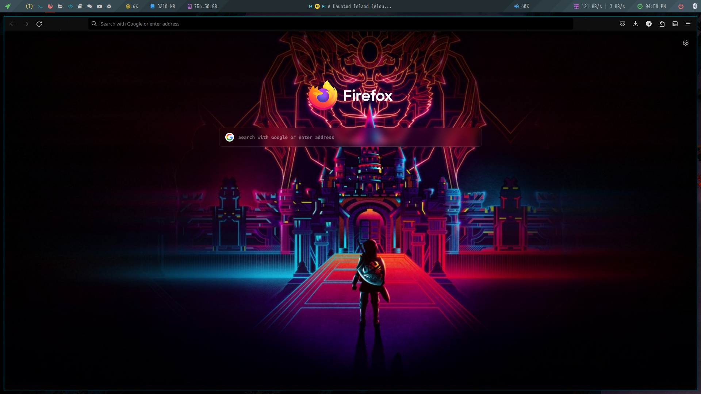

  # Minimal Firefox   
  A minamist and aesthetic userstyle theme for Firefox.   
  
     
  ## Installation   
     
  - In the ```about:config``` page on your Firefox browser, set the following parameters to **True** :
  - ```toolkit.legacyUserProfileCustomizations.stylesheets```
  - Replace the **chrome** folder with the one from this repository. You can find the **chrome** folder here :
  - On Linux : ```$HOME/.mozilla/firefox/######.default-release/chrome/```
  - On Windows : ```%appdata%\Mozilla\Firefox\Profiles\######.default-release\chrome\```
  - On MacOS : ```Users/[USERNAME]/Library/Application Support/Firefox/Profiles/######.default-release/chrome```
  - If it doesn't exist already, create a folder called chrome


Install [Tree Style Tab](https://addons.mozilla.org/en-US/firefox/addon/tree-style-tab/)
If you can't see your tabs, ensure that you have [Tree Style Tab](https://addons.mozilla.org/en-US/firefox/addon/tree-style-tab/) installed. 
If you do, press F1 while in Firefox to show or hide your tabs.
If you have installed Tree Style Tab, you tried the previous step, and you still can't see your tabs, check to see if you're running 
in [Private Browsing](https://support.mozilla.org/en-US/kb/private-browsing-use-firefox-without-history) mode. If so, ensure that 
Tree Style Tab is permitted to run in this mode by enabling the "Run in Private Windows" setting in Firefox's `about:addons` menu.
## Screenshots


     
